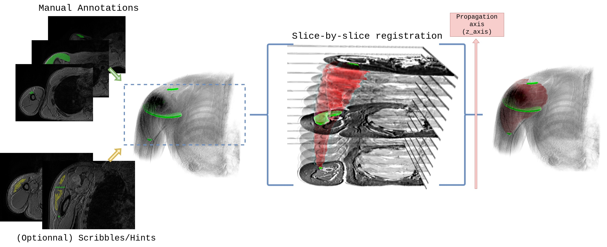

# LabelProp : A semi-automatic segmentation tool for 3D medical images

[](https://labelprop.readthedocs.io/en/latest/)
[](https://github.com/nathandecaux/labelprop/raw/main/LICENSE)
[](https://pypi.org/project/deep-labelprop)
[](https://python.org)


3D semi-automatic segmentation using deep registration-based 2D label propagation
---------------------------------------------------------------------------------
---

Check [napari-labelprop](https://github.com/nathandecaux/napari-labelprop) plugin for use in the napari viewer. 
See also the [napari-labelprop-remote](https://github.com/nathandecaux/napari-labelprop-remote) plugin for remote computing.

---------------------------------------------------------------------------------
---
## About

See "Semi-automatic muscle segmentation in MR images using deep registration-based label propagation" paper : 

[[Paper]](https://www.sciencedirect.com/science/article/pii/S0031320323002297?casa_token=r5FPBVXYXX4AAAAA:mStyUXb0i4lGqBmfF1j5fV1T9FuCMrpYfwh3lwQve2XAnzUBPZviAiFgMtH7lv6hdcWsA7yM) [[PDF]](https://hal.science/hal-03945559/document) [[GUI]](https://github.com/nathandecaux/napari-labelprop)
<p>
  
</p>

## Installation

Using pip

    pip install deep-labelprop

or to get the development version (recommended):

    pip git+https://github.com/nathandecaux/labelprop.git

## Usage

<details open>
<summary><h2>Data</h2></summary>
Labelprop operates semi-automatically, in an intra-subject mode, and can therefore be used with a single scan. 

The scan must be a gray intensity volume, dimension 3 ( ```HWL``` ).

Manual annotations must be supplied in an ```uint8``` file of the same size, where each voxel value corresponds to the label class ( ```0``` as background). 

Most MRI scans are isotropic on one plane only, due to the thickness of the slice. Manual annotations must be provided in the isotropic plane. Propagation is therefore performed in the 3rd dimension (to be indicated with ```z_axis```).

Free-form scribbles/indications can also be supplied. This allows the user to annotate certain parts, without having to completely delineate a cut. In addition, hints can be provided in all planes, and outside the annotated top and bottom section, enabling propagation to be extrapolated. The hints file must be of the same type and size as the manual annotations file, with the same class/label correspondences. To specify a hint as part of the background class, voxels must have the label ```255```.

Pretrained weights can be downloaded [here](https://raw.githubusercontent.com/nathandecaux/napari-labelprop/main/pretrained.ckpt).

</details>

<details open>
<summary><h2>Basic Usage</h2></summary>

Let's consider the following scan ```scan.nii.gz``` and a corresponding segmentation file with 3 annotated slices ```manual_annotation.nii.gz```, and some few freehand annotations  in ```hints.nii.gz``` :



Training and propagation can be done for this single scan as follow :
```python
import nibabel as ni
from labelprop.napari_entry import train_and_infer

scan=ni.load('scan.nii.gz').get_fdata() # Numpy array of dimension (H,W,L)
manual_annotations=ni.load('manual_annotations.nii.gz').get_fdata() # Numpy array of dimension (H,W,L) and dtype uint8
hints=ni.load('hints.nii.gz').get_fdata() # Numpy array of dimension (H,W,L) and dtype uint8
# Train and propagate 
propagations=train_and_infer(
    img=scan,
    mask=manual_annotations,
    pretrained_ckpt='pretrained.ckpt',
    shape=256, # Size of input images for training.
    max_epochs=100,
    z_axis=2, # Propagation axis.
    output_dir='path/to/savedir', 
    name='nameofcheckpoint',
    pretraining=False, # If True, will pretrain the model without using manual_annotations.
    hints=hints, # Optional hints for the propagation. Numpy array of dimension (H,W,L) and dtype uint8
)

propagation_up=propagations[0] # Propagation from the bottom to the top 
propagation_down=propagations[1] # Propagation from the top to the bottom

fused_propagated_annotations=propagations # Fusion of propagation_up and propagation_down. 
# Save results
ni.save(ni.Nifti1Image(fused_propagated_annotations,ni.load('img.nii.gz').affine),'propagated_fused.nii.gz')
```
</details>

<details open>
<summary><h2>CLI</h2></summary>
Basic operations can be done using the command-line interface provided in labelprop.py at the root of the project.


#### Pretraining

Although Labelprop works on a single scan, it is preferable to pre-train the model on a dataset, with or without manual annotations. 

  ##### Self-supervised
    
  To pretrain the model without using any manual annotations :

    $ labelprop pretrain --help
    Usage: labelprop.py pretrain [OPTIONS] IMG_LIST

    Pretrain the model on a list of images. The images are assumed to be
      greyscale nifti files. IMG_LIST is a text file containing line-separated
      paths to the images.

    Options:
      -s, --shape INTEGER         Image size (default: 256)
      -z, --z_axis INTEGER        Axis along which to propagate (default: 2)
      -o, --output_dir DIRECTORY  Output directory for checkpoint
      -n, --name TEXT             Checkpoint name (default : datetime)
      -e, --max_epochs INTEGER    

  In this case, the model simply learns to register successive sections with each other, without any anatomical constraints on propagation. 

  ##### With annotations

  Now, to train the model with sparse manual annotations :

    $ labelprop train-dataset --help
    Usage: labelprop train-dataset [OPTIONS] IMG_MASK_LIST

      Train the model on a full dataset. The images are assumed to be greyscale
      nifti files. Text file containing line-separated paths to greyscale images
      and comma separated associated mask paths

    Options:
      -c FILE                     Path to the pretrained checkpoint (.ckpt)
      -s, --shape INTEGER         Image size (default: 256)
      -z, --z_axis INTEGER        Axis along which to propagate (default: 2)
      -o, --output_dir DIRECTORY  Output directory for checkpoint
      -n, --name TEXT             Checkpoint name (default : datetime)
      -e, --max_epochs INTEGER
      --help                      Show this message and exit.
#### Training

    $ labelprop train --help
    Usage: labelprop.py train [OPTIONS] IMG_PATH MASK_PATH

    Train a model and save the checkpoint and predicted masks. IMG_PATH is a
      greyscale nifti (.nii.gz or .nii) image, while MASKPATH is it related sparse
      segmentation.

    Options:
      -h, --hints FILE            Path to the hints image (.nii.gz)
      -s, --shape INTEGER         Image size (default: 256)
      -c, --pretrained_ckpt FILE  Path to the pretrained checkpoint (.ckpt)
      -e, --max_epochs INTEGER
      -z, --z_axis INTEGER        Axis along which to propagate (default: 2)
      -o, --output_dir DIRECTORY  Output directory for checkpoint and predicted
                                  masks
      -n, --name TEXT             Prefix for the output files (checkpoint and
                                  masks)

#### Propagating (inference)

    $ labelprop propagate --help
    Usage: labelprop.py propagate [OPTIONS] IMG_PATH MASK_PATH CHECKPOINT

    Propagate labels from sparse segmentation.  IMG_PATH is a greyscale nifti
      (.nii.gz or .nii) image, while MASKPATH is it related sparse segmentation.
      CHECKPOINT is the path to the checkpoint (.ckpt) file.

    Options:
      -h, --hints FILE            Path to the hints image (.nii.gz)
      -s, --shape INTEGER         Image size (default: 256)
      -z, --z_axis INTEGER        Axis along which to propagate (default: 2)
      -l, --label INTEGER         Label to propagate (default: 0 = all)
      -o, --output_dir DIRECTORY  Output directory for predicted masks (up, down
                                  and fused)
      -n, --name TEXT             Prefix for the output files (masks)

</details>


<details open>
<summary><h2>GUI</h2></summary>

See this [repo](https://github.com/nathandecaux/napari-labelprop) to use 
labelprop main functions in Napari (cf. the GIF in the About section). 

See also [napari-labelprop-remote](https://github.com/nathandecaux/napari-labelprop-remote) to run labelprop in a separate process, locally or remotely, which uses the [API](https://github.com/nathandecaux/labelprop/blob/master/labelprop/api.py):

<p align="center">
  
</p>

</details>


## How to contribute
Anyone wishing to contribute to Labelprop is invited to read the doc [here](https://labelprop.readthedocs.io/en/latest/), then create a pull request or create an issue. 
Contributions concerning the graphical interface, with napari or otherwise, would also be very welcome, and can refer to the [napari_entry](https://labelprop.readthedocs.io/en/latest/labelprop/napari_entry/#napari-entry) doc or the [API](https://labelprop.readthedocs.io/en/latest/labelprop/api/). 


